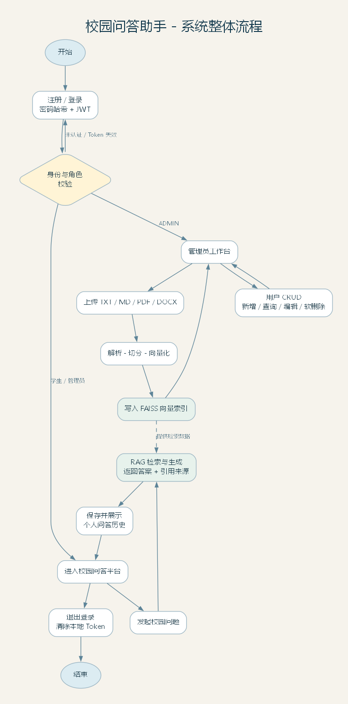
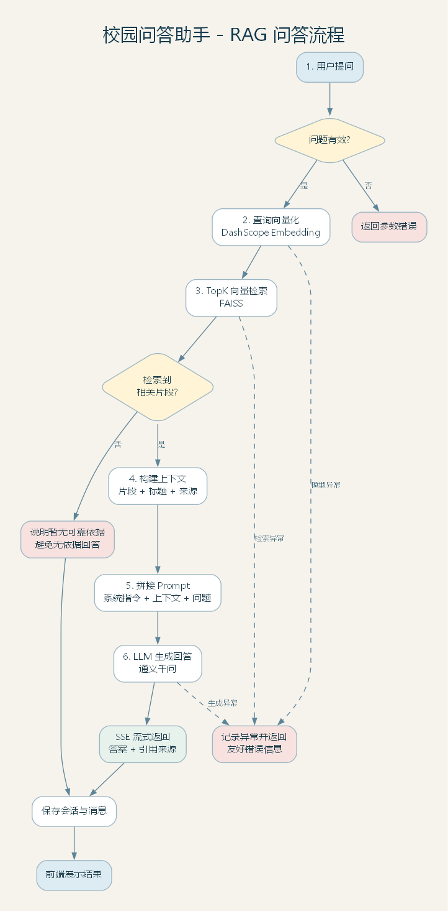

# Day2 流程图

本目录包含今日要求的两张流程图，均提供可编辑源文件、SVG 矢量图和 PNG 图片。

## 系统整体流程



系统覆盖注册登录、JWT 鉴权、校园问答、会话历史、管理员用户 CRUD、知识文档上传与索引、退出登录等完整链路。

## RAG 问答流程



RAG 链路覆盖问题校验、查询向量化、FAISS TopK 检索、上下文构建、Prompt 拼接、LLM 生成、SSE 流式输出、引用来源与异常分支。

## 源文件

- `system-flow.dot`: 系统整体流程图 Graphviz 源文件
- `rag-flow.dot`: RAG 流程图 Graphviz 源文件

重新生成图片：

```powershell
dot -Tpng system-flow.dot -o 系统整体流程.png
dot -Tsvg system-flow.dot -o 系统整体流程.svg
dot -Tpng rag-flow.dot -o RAG问答流程.png
dot -Tsvg rag-flow.dot -o RAG问答流程.svg
```
